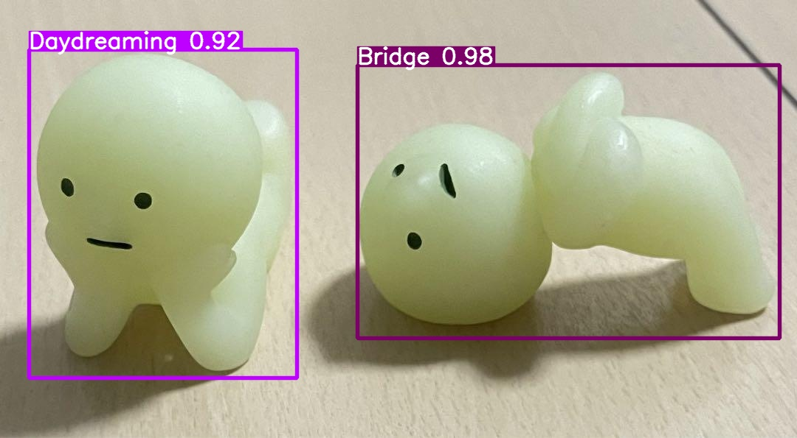

# Smiski Identifier!

Only trained my model to have only series 1 to series 4 however.
But works pretty well in identifying smiskis in images!

## To Run

Firstly, install requirements.txt using pip to your vitural enviorment!
You could either run a model I've trained to predict some images containing smiskis or train the yolov8 model yourself with the images I've labelled in smiski_all folder!